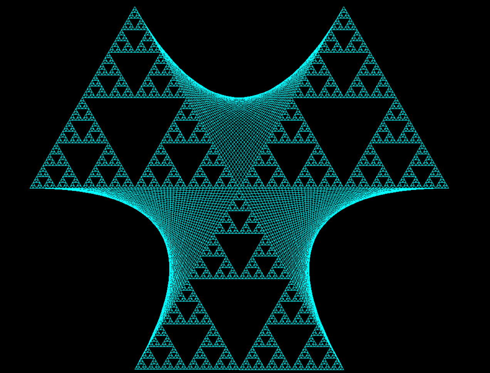
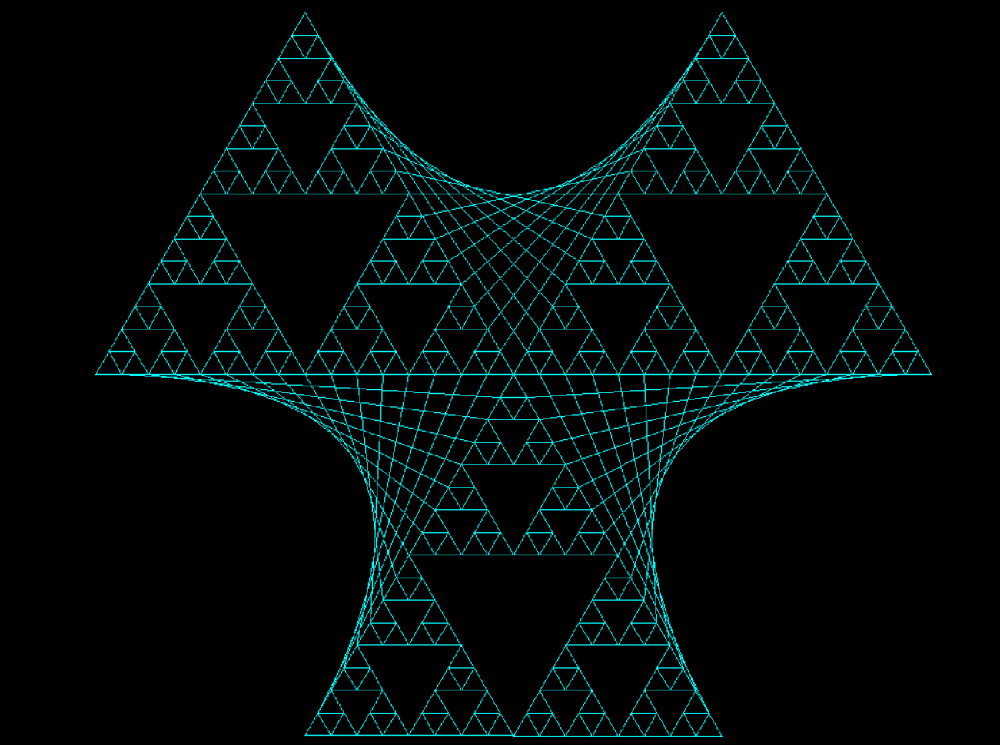
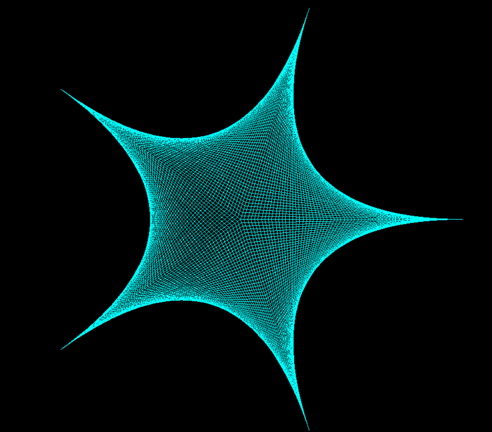
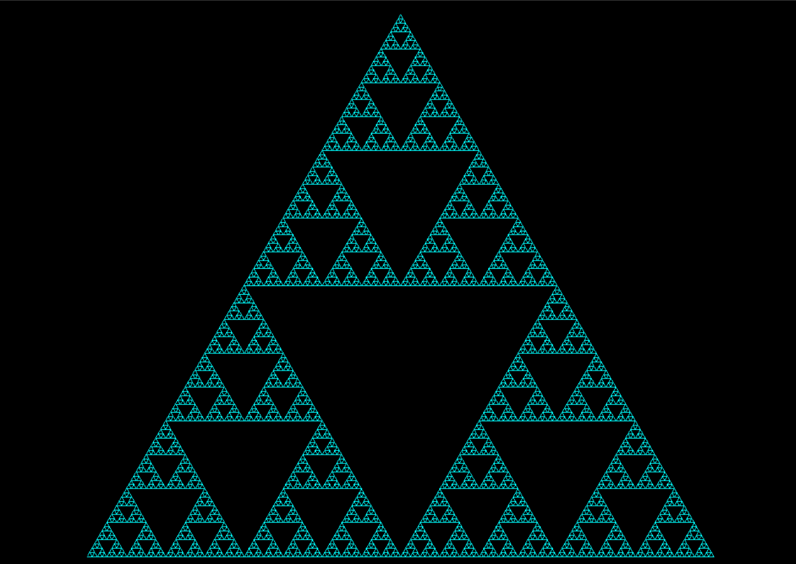

# Fractal Pattern Generator

A Python turtle graphics program that draws beautiful fractal patterns.

## Patterns

### Sierpinski Envelope




### Envelope Star



### Sierpinski Triangle



## Usage

Basic usage:

```bash
python main.py
```

With options:

```bash
python main.py --pattern sierpinski_triangle --depth 6 --color cyan --bgcolor black
```

### Options

- `--pattern` - Pattern to draw: `sierpinski_triangle`, `envelope_star`, or `sierpinski_envelope` (default)
- `--depth` - Recursion depth (default: 6)
- `--speed` - Drawing speed 1-10 (default: 10)
- `--color` - Pattern color (default: white)
- `--bgcolor` - Background color (default: black)
- `--points` - Number of star points for envelope_star pattern (default: 6, minimum: 3)
